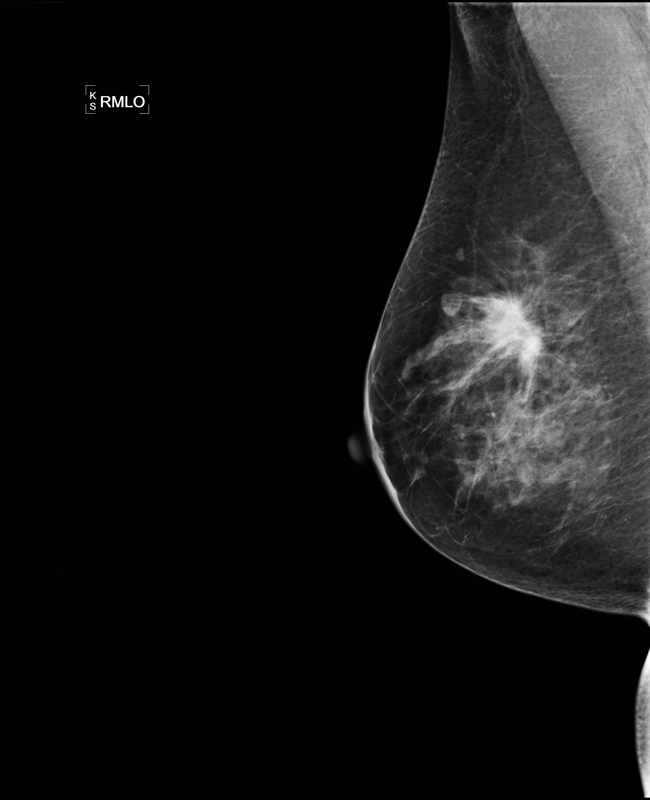
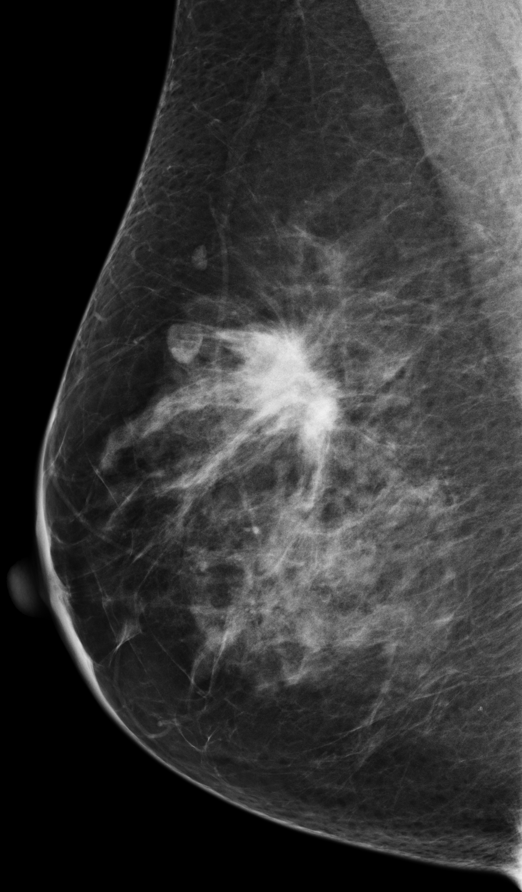
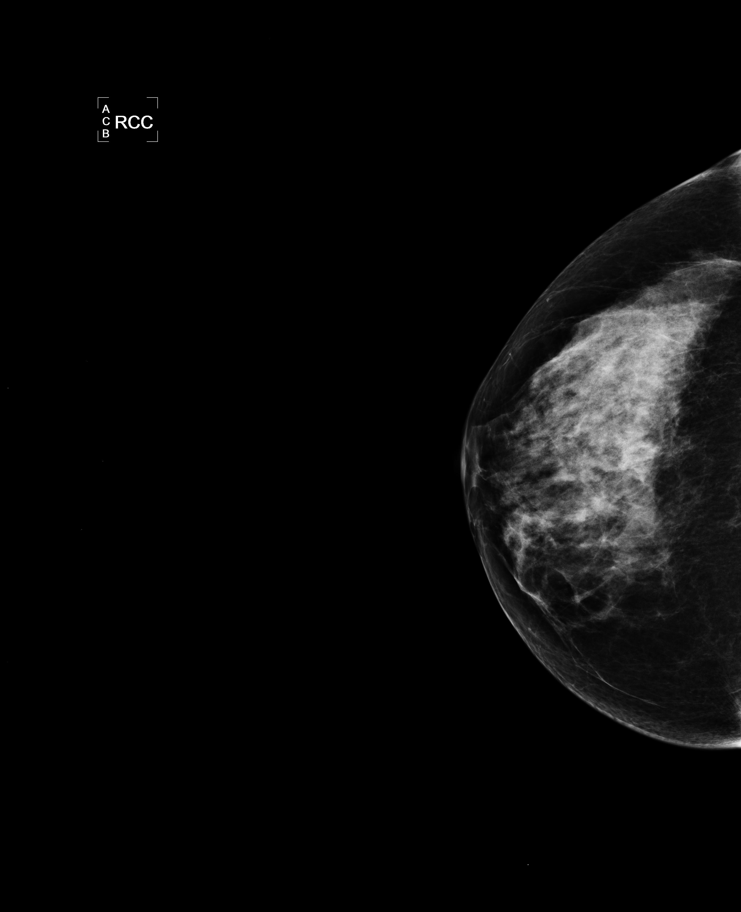
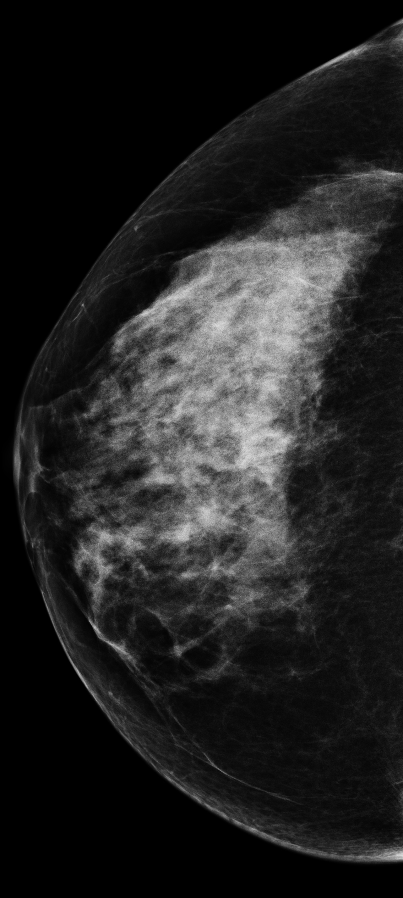
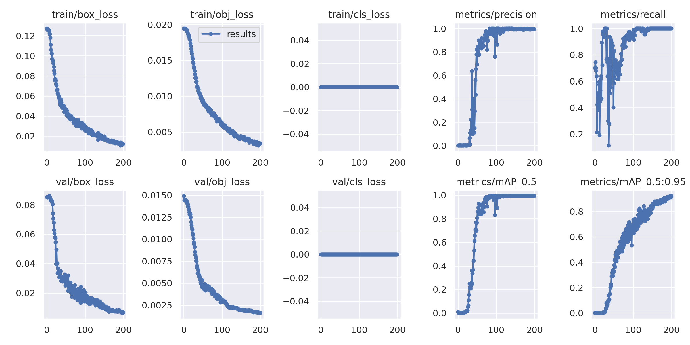
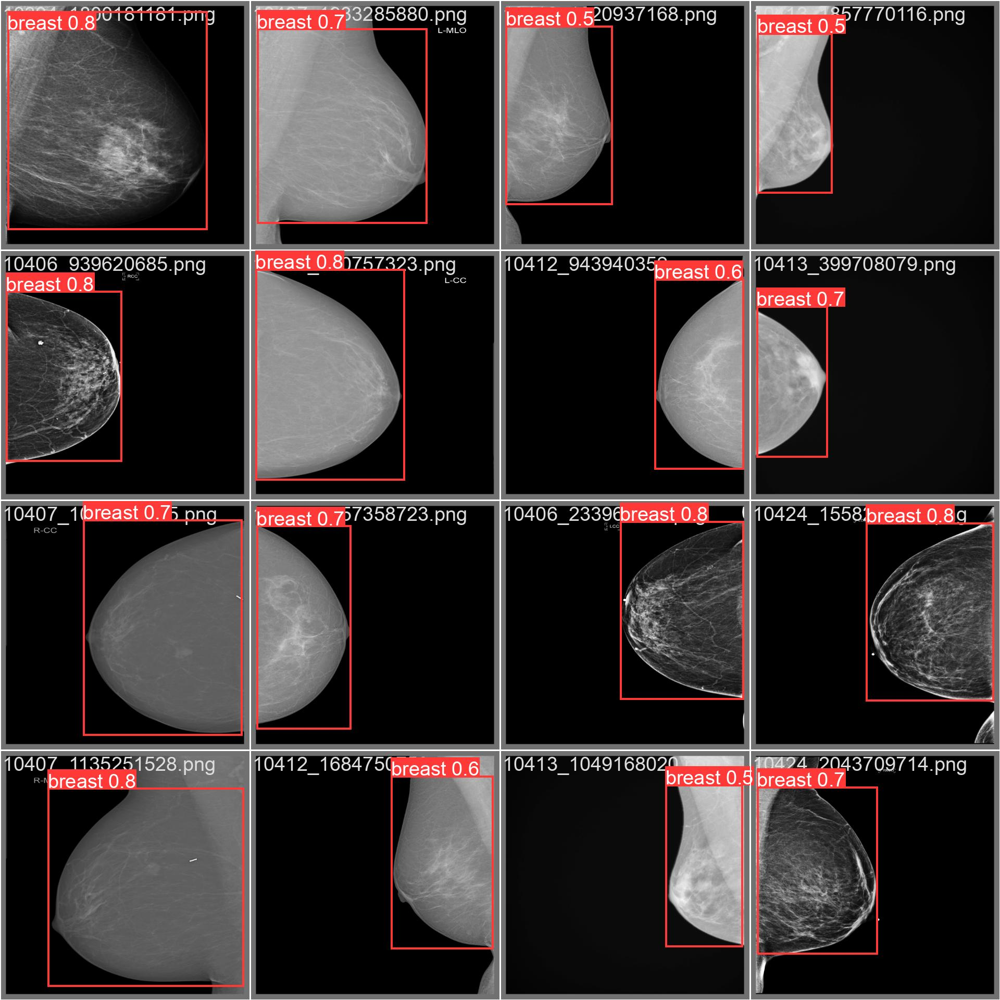

## 乳腺通用检测(Breast-ROI-Detection) [在线使用](https://huggingface.co/spaces/NatureAI/Breast-ROI-Detection)

- **面临的问题**：常见的乳腺图像中会含有乳腺的**拍摄角度信息(见下原图1和2)** 以及**大面积的无效阴影区域(据统计，通常这些阴影区域面积会占到整张图的50%及以上)** 。
- **解决的意义**：删除无用的背景阴影和角度信息，更加凸显乳腺区域的特征信息。
- **应用的前景**：在乳腺图像相关任务上的数据前期预处理（冗余区域切割、检测任务中对其它未标注乳腺进行预标注），如[RSNA 2023乳腺疾病分类竞赛](https://www.kaggle.com/competitions/rsna-breast-cancer-detection/overview) 。
- **实现的方式**：对RSNA 2023提供的乳腺疾病分类竞赛数据进行人工预先标注(Voc格式，500张)，使用高效的目标检测模型(如YOLOX、YOLOv5等)进行训练得到预训练权重，从而对于其它任务中的乳腺图像进行检测切割操作。

|原图1|Breast-ROI-Detection处理后的图1|原图2|Breast-ROI-Detection处理后的图2|
|:-:|:-:|:-:|:-:|
|||||

## 推理
> 本仓库已经提供了mAP@.5:.95为94的模型，可以直接使用。[权重](https://github.com/mpu-tt/breast-detection/tree/main/weights)

1. 准备自己的乳腺图像，假设该文件夹名称为`demo`；
2. 获取切割图
```python
python detect.py --weights weights/best.pt \
                 --source demo \ # file、dir、url、screen、cam
                 --imgsz 640 \
                 --conf-thres 0.25 \
                 --iou-thres 0.45 \
                 --device 0 \
                 --save-crop 
```
即可在运行代码终端看到提取的关键区域乳腺图像。

3. 获取检测标签
```python
python detect.py --weights weights/best.pt \
                 --source demo \ # file、dir、url、screen、cam
                 --imgsz 640 \
                 --conf-thres 0.25 \
                 --iou-thres 0.45 \
                 --device 0 \
                 --save-txt
```
即可在运行代码终端看到提取的标注文件，获取的标注文件为yolo格式。将[yolo 标注转VOC格式](https://blog.csdn.net/Dontla/article/details/100154301) 或者其它可用格式。

## 训练（可选）

> 在一些更加具体的任务上，推荐大家手工标注100张乳腺数据重新训练一个检测模型，适配自己的乳腺图像切割任务。

1. 数据集基于[remekkinas/rsna-roi-detector-annotations-yolo](https://www.kaggle.com/datasets/remekkinas/rsna-roi-detector-annotations-yolo)
2. 模型基于[ultralytics/yolov5-v7.0](https://github.com/ultralytics/yolov5/tree/v7.0)
3. 预训练权重基于[yolov5s.pt](https://github.com/ultralytics/yolov5/releases/download/v7.0/yolov5s.pt)

```python
python train.py --weights yolov5s.pt \ # 预训练权重
                --cfg models/yolov5s-breast.yaml \ # 模型配置
                --data dataset/data.yaml \ # 数据配置
                --hyp data/hyps/hyp.breast.yaml \ # 超参数配置
                --epochs 100 \
                --batch-size 512 \
                --imgsz 640 \
                --device 0
```





## 存在的问题

1. 上图[第一行第三列乳腺图像](https://github.com/mpu-tt/breast-detection/raw/main/images/train_epoch_vis.jpg) 经过裁剪会丢失掉胸肌部分信息，所以需要大家在具体任务重新训练检测模型。
2. 训练的`batch size`、`image size`都需要根据具体任务和机器进行调整。

## 其它资源

1. 乳腺检测标注数据集：https://www.kaggle.com/datasets/remekkinas/rsna-roi-detector-annotations-yolo
2. 分割好的乳腺数据集：https://www.kaggle.com/datasets/remekkinas/rsna-breast-cancer-detection-poi-images
